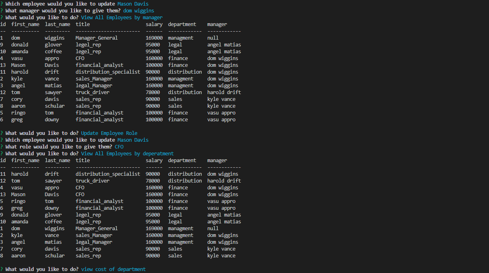

# Employee-Tracker


## Deployed link
none: howevre here is a link to a walkthrough of the user interface ::  https://drive.google.com/file/d/1zH3WmLLtUgZmxpRWJAsCsvNx2i2EDwbv/view 

## site picture



## Technologies Used
- JavaScript : Used to give the page logical functions and a dynamic interface
- Git : Used to version control the code during the creation process
- GitHub : hosting the repositroy responsible for the website

## Authors
- writen styled and built by Mason Davis

## summary
This repository contains all the code to generate database for keeping track of a department store and its various employees, departments, and managers. 

## Code Snippet
This is a snippet Showing the formula used to generate the tables that dispaly the employee data.

```javaScript
function viewEmp(passOrder){
    db.query(   `SELECT emp.id, emp.first_name, emp.last_name, role.title, role.salary ,department.name AS department , CONCAT(m.first_name, ' ', m.last_name) AS manager
                FROM department_employee AS emp 
                JOIN department_role AS role ON  emp.role_id = role.id
                JOIN department ON  role.department_id = department.id
                LEFT JOIN department_employee AS m ON m.id = emp.manager_id
                ORDER BY ${passOrder}`,
                 function (err, results) {
        console.table(results);
        onStart()
  });
}     
```


## Author links
[LinkedIn](https://www.linkedin.com/in/davis-mason-t/)
[GitHub](https://github.com/Md7113)